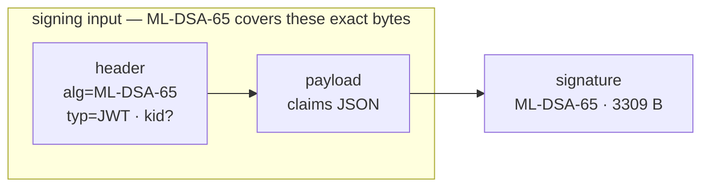
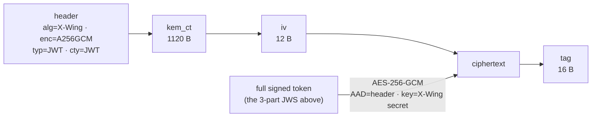

# Design notes — PostQuantum.Jwt

Working notes on the wire format and cryptographic construction. Authoritative
security statements live in [`../SECURITY.md`](../SECURITY.md); gaps in
[`../KNOWN-GAPS.md`](../KNOWN-GAPS.md).

## Goals

- JOSE-style post-quantum tokens: ML-DSA-65 signatures (post-quantum, not hybrid)
  with optional hybrid X-Wing + AES-256-GCM confidentiality.
- Native BCL primitives wherever they exist; one vetted dependency (BouncyCastle)
  for the single gap (X25519 + SHA3-256).
- Fail-closed validation, small surface, honest docs.

## Token formats (JOSE compact serialization)

### Signed (3 segments)

```
BASE64URL(header) "." BASE64URL(payload) "." BASE64URL(signature)
```

- `header` = `{"alg":"ML-DSA-65","typ":"JWT"[, "kid":...]}`
- `signature` = `ML-DSA-65.SignData( ASCII(header "." payload) )`

### Encrypted (5 segments) — sign-then-encrypt

The signed token above is the **plaintext**, then wrapped:

```
BASE64URL(header) "." BASE64URL(kem_ct) "." BASE64URL(iv) "."
BASE64URL(ciphertext) "." BASE64URL(tag)
```

- `header` = `{"alg":"X-Wing","enc":"A256GCM","typ":"JWT","cty":"JWT"}`
- `kem_ct` = X-Wing ciphertext (1120 bytes = ML-KEM-768 ct ‖ X25519 ephemeral pk)
- `iv` = 12-byte AES-GCM nonce, `tag` = 16-byte GCM tag
- AAD = `ASCII(BASE64URL(header))`
- AES-256-GCM key = the 32-byte X-Wing shared secret (used directly)

### At a glance

**Signed (3 segments).** The ML-DSA-65 signature covers the *exact transmitted*
header and payload bytes, so a header/payload parser differential cannot forge an
accepted token:



**Encrypted (5 segments, sign-then-encrypt).** The *entire* signed token is the
AES-256-GCM plaintext — which is why an encrypted token (~7.8 KB) is larger than a
signed one (~4.6 KB) plus the KEM material alone:



Segments are joined by `.` (JOSE compact serialization).

## X-Wing (`draft-connolly-cfrg-xwing-kem`)

Shared secret:

```
ss = SHA3-256( ss_ML-KEM ‖ ss_X25519 ‖ ct_X25519 ‖ pk_X25519 ‖ label )
label = 0x5C 0x2E 0x2F 0x2F 0x5E 0x5C   ("\.//^\")
```

The label is concatenated **last** (per the spec), and key generation is the
spec's `expandDecapsulationKey`: `SHAKE-256(seed, 96)` → ML-KEM seed `d‖z`
(bytes 0–63) and X25519 private key (bytes 64–95). Both paths are checked against
the official `spec/test-vectors.json` KATs (decapsulation + keygen).

Sizes (ML-KEM-768): encapsulation key 1184 B, ciphertext 1088 B; X25519 keys and
ciphertext 32 B each. Public key encoding = `ek_ML-KEM ‖ pk_X25519` (1216 B).
Private key encoding = `dk_ML-KEM ‖ sk_X25519`.

## Validation order (fail-closed)

1. Segment count → signed (3) or encrypted (5); anything else rejected.
2. Encrypted: require decryption key → check `alg`/`enc` → X-Wing decapsulate →
   AES-GCM decrypt (AAD = header). Tag mismatch ⇒ reject. Result must be a 3-part
   signed token.
3. Signed: check `alg == ML-DSA-65` (reject otherwise — no `none`) → verify
   signature → parse claims → validate `exp`/`nbf` (skew), `iss`, `aud`.

Any failure throws `PqJwtValidationException`; misconfiguration throws
`PqJwtException`.

---

*To God be the glory — 1 Corinthians 10:31.*
