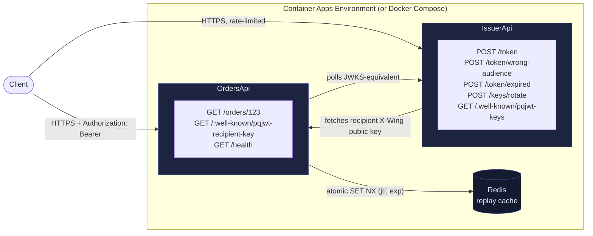
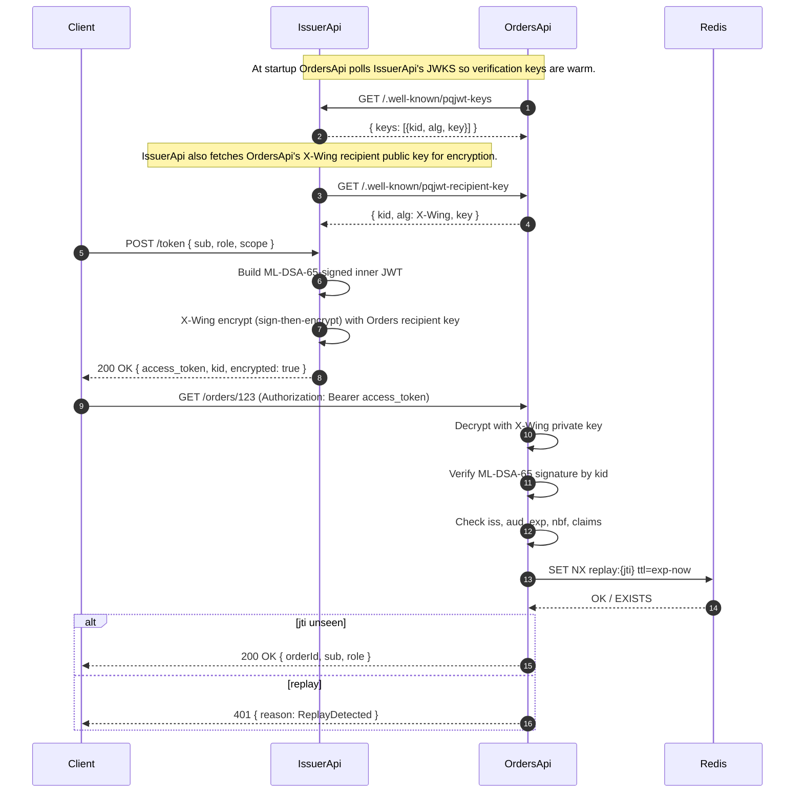

# PostQuantum.Jwt ProductionDeploymentDemo

> ⚠ **DEMO ONLY.** Tokens minted by the live deployment use *ephemeral* keys that
> reset on every cold start. Public ingress is rate-limited (10/min issuer,
> 20/min orders, per IP). Never trust these tokens for anything that matters —
> they exist so reviewers can poke at a real running PostQuantum.Jwt
> deployment, not for production use.

A production-shaped, intentionally boring, service-to-service deployment demo for `PostQuantum.Jwt`.

> **▶ Live now:** <https://demo.pqjwt.systemslibrarian.dev> — an interactive
> HTML UI hosted by the IssuerApi process itself, with live buttons that drive
> the full 8-step demo (issue → validate → replay-reject → tamper-reject →
> wrong-audience → expired → rotate → retire) end-to-end against the real
> OrdersApi + Redis sidecar. Each rejection shows the typed `PqJwtFailureReason`
> the verifier returned on the wire — see the "Wire-truth demo tradeoff"
> section below for why visitors can see that and a production verifier
> deliberately can't.
> See [`azure/`](azure/) for the deploy-it-yourself Bicep + scripts
> (~6 min, idle cost rounds to $0).

This sample is different from the smaller samples in this repository. It does not merely show how to call the builder or validator. It shows the operational pattern around the token:

- one trusted issuer service
- one protected Orders API service
- short-lived ML-DSA-65 signed tokens
- optional X-Wing sign-then-encrypt token wrapping
- `kid`-based signing-key rotation
- issuer-published public key directory
- verifier-side key refresh
- Redis-backed replay protection using atomic `SET NX`
- tamper rejection
- wrong-audience rejection
- expired-token rejection
- previous-key overlap during rotation
- previous-key retirement and fail-closed validation
- Docker Compose runbook
- scripted pass/fail proof

> To God be the glory — 1 Corinthians 10:31.

## What this is

This is a reference deployment shape for controlled `.NET` systems where the same organization owns the issuer and every verifier.

It demonstrates the boring things that matter in real systems:

```text
token issuance
service boundary
public-key publication
key refresh
key rotation
replay defense
claim validation
failure behavior
operator-visible proof
```

## What this is not

This is not:

- an OAuth/OIDC provider
- a drop-in replacement for `AddJwtBearer`
- a generic JWT interoperability demo
- a claim of independent audit
- a recommendation to put unaudited preview crypto in high-risk production

PostQuantum.Jwt intentionally targets controlled issuer/verifier systems. Generic JWT libraries do not understand this profile.

## Architecture



### Sequence — a single signed-and-encrypted token, end to end



### ASCII fallback (for environments that don't render Mermaid)

```text
+---------------------+                         +----------------------+
| IssuerApi           |                         | OrdersApi             |
|---------------------|                         |----------------------|
| owns ML-DSA private |                         | owns no signing key   |
| signing keys        |                         | fetches public keys   |
|                     |                         | from IssuerApi        |
| POST /token         | ---- bearer token ----> | GET /orders/123       |
| GET /.well-known/   | <--- key directory ---- | validates by kid      |
| pqjwt-keys          |                         | checks replay in Redis|
|                     |                         |                      |
| optional encrypted  | ---- fetch recipient -> | publishes X-Wing      |
| token mode          |      public key         | recipient public key  |
+---------------------+                         +----------------------+
           |                                                   |
           +---------------- Docker Compose network ------------+
                                      |
                                      v
                                  Redis
                            atomic replay cache
```

## Token modes

This demo supports both modes.

### Signed-only

The issuer signs a compact 3-part token with ML-DSA-65.

```text
header.payload.signature
```

### Signed then encrypted

When `PQJWT_ENCRYPTED_TOKENS=true`, the issuer first signs the token, then encrypts the signed token for the Orders API using X-Wing and AES-256-GCM.

```text
protected-header.kem-ciphertext.nonce.ciphertext.tag
```

The Orders API owns the X-Wing private key. The issuer only fetches the Orders API public recipient key from:

```http
GET /.well-known/pqjwt-recipient-key
```

## Services

### IssuerApi

Endpoints:

```http
POST /token
POST /token/wrong-audience
POST /token/expired
POST /keys/rotate
POST /keys/retire-previous
GET  /keys/status
GET  /.well-known/pqjwt-keys
GET  /health
```

The issuer owns the ML-DSA private signing keys and never exposes private key material.

Key states:

```text
active    signs new tokens and is published for verification
previous  no longer signs new tokens but remains published during overlap
retired   no longer published; tokens using that kid fail closed
```

### OrdersApi

Endpoints:

```http
GET /orders/123
GET /.well-known/pqjwt-recipient-key
GET /health
```

The Orders API:

- has no signing key
- refreshes issuer public keys in the background and resolves `kid` from an in-memory cache
- validates `iss`, `aud`, `exp`, `kid`, and signature
- requires replay protection at startup
- uses Redis for atomic replay defense when configured
- owns the X-Wing private key for encrypted tokens
- returns generic 401/403 problem details without leaking validator internals

## Wire-truth demo tradeoff (`EXPOSE_FAILURE_REASON`)

The live OrdersApi reads an `EXPOSE_FAILURE_REASON=true` env var (set in
[`azure/main.bicep`](azure/main.bicep) and in
[`docker-compose.yml`](docker-compose.yml)). When set, the 401
problem-details response body includes a `failureReason` field carrying
the typed `PqJwtFailureReason` the validator surfaced:

```json
{
  "type": "about:blank",
  "title": "Unauthorized",
  "status": 401,
  "detail": "No valid PostQuantum.Jwt bearer token was accepted.",
  "correlationId": "...",
  "failureReason": "ReplayDetected"
}
```

The browser-driven landing page reads `failureReason` directly from the
wire instead of guessing the reason client-side. That's what makes the
demo legible — visitors can prove the validator surfaced the right reason
for the right step.

**This is a deliberate demo-only tradeoff and a production verifier must
never set it.** The typed reason is a precise oracle that helps an
attacker narrow down which validation gate they tripped — exactly the
information a generic-401 production posture is meant to deny. The
default for the env var is `false`; the docker-compose and Bicep
templates set it `true` explicitly with inline comments calling this out.

When the env is on, the OrdersApi also exposes a `POST /admin/refresh-keys`
endpoint that the landing-page step 8 uses to force an immediate
verifier-side JWKS refresh after a key retirement (the alternative is to
poll the issuer-side JWKS as a proxy and race Orders' background refresh).

## Deploy to Azure Container Apps (live demo)

For a public, internet-reachable instance of this demo, the
[`azure/`](azure/) folder has Bicep + one-shot deploy scripts. Three
Container Apps (issuer, orders, redis sidecar) inside one managed
Environment, scale-to-zero, public ingress with per-IP rate limiting.

```powershell
cd samples/ProductionDeploymentDemo/azure
.\deploy.ps1                                # ~4-6 min; idle cost ≈ $0
```
```bash
cd samples/ProductionDeploymentDemo/azure
./deploy.sh                                 # ~4-6 min; idle cost ≈ $0
```

The script prints the public URLs on success. Open the Issuer landing page
to drive the demo from a browser — every endpoint has a button. Container
images are public on `ghcr.io/systemslibrarian/pqjwt-demo-{issuer,orders}`
so no registry credentials are required. See
[`azure/README.md`](azure/README.md) for cost, logs, custom domains, and
teardown.

## Run with Docker Compose

From the repository root:

```bash
docker compose -f samples/ProductionDeploymentDemo/docker-compose.yml up --build
```

Published ports:

```text
IssuerApi  http://localhost:5180
OrdersApi  http://localhost:5190
Redis      localhost:6379
```

## Run the proof script

Linux/macOS:

```bash
samples/ProductionDeploymentDemo/run-demo.sh
```

Windows PowerShell:

```powershell
.\samples\ProductionDeploymentDemo\run-demo.ps1
```

Expected output:

```text
[PASS] issuer health check
[PASS] orders-api health check
[PASS] encrypted token issued as 5-part compact token
[PASS] encrypted token accepted by orders-api
[PASS] signed-only token accepted by orders-api
[PASS] first use of replay-test token accepted
[PASS] replayed token rejected
[PASS] tampered token rejected
[PASS] wrong-audience token rejected
[PASS] expired token rejected
[PASS] key rotation publishes active + previous keys
[PASS] old-key token accepted during overlap
[PASS] previous key retired
[PASS] old-key token rejected after retirement

ProductionDeploymentDemo complete: 14/14 checks passed.
```

## Security notes

### Replay protection

The Orders API uses Redis when `REDIS_CONNECTION` is set. The implementation uses `SET key value NX PX ttl`, which is atomic at the Redis server and is the right primitive for multi-node replay defense.

If Redis is not configured, the API falls back to `InMemoryReplayCache` and logs a warning. That fallback is useful for local development only.

### Issuer key refresh

The Orders API refreshes the issuer key directory in the background. Authentication-time `kid` resolution is a pure in-memory lookup, so the protected request path does not perform sync-over-async HTTP. The `/health` endpoint reports `503 warming-up` until at least one issuer key has been cached.

### Key directory transport

The Docker demo uses HTTP inside a private Compose network for convenience.

Production deployments should publish the issuer key directory over HTTPS, mTLS, service mesh identity, signed config, or another authenticated channel. The key directory is a trust root: whoever controls that response controls which public keys the verifier accepts.

### Recipient encryption key

For demo simplicity, the Orders API generates an ephemeral X-Wing recipient key at startup and publishes the public half. The issuer uses a singleton `RecipientKeyClient` with a short refresh interval instead of a per-request accidental fetch or a forever cache. A real deployment should load the X-Wing private key from a vault/HSM/sealed secret and rotate it deliberately with a documented overlap window.

### Encrypted tokens do not remove the need for validation

In encrypted mode, the Orders API still validates:

- ML-DSA signature
- issuer
- audience
- lifetime
- `kid`
- `jti` replay state
- required claims

Encryption hides the signed token in transit/storage. It does not replace signature and claim validation.

## Build directly

```bash
dotnet build samples/ProductionDeploymentDemo/IssuerApi/IssuerApi.csproj
dotnet build samples/ProductionDeploymentDemo/OrdersApi/OrdersApi.csproj
```

## Add to samples solution

From the repository root:

```bash
dotnet sln samples/PostQuantum.Jwt.Samples.slnx add \
  samples/ProductionDeploymentDemo/IssuerApi/IssuerApi.csproj \
  samples/ProductionDeploymentDemo/OrdersApi/OrdersApi.csproj
```
